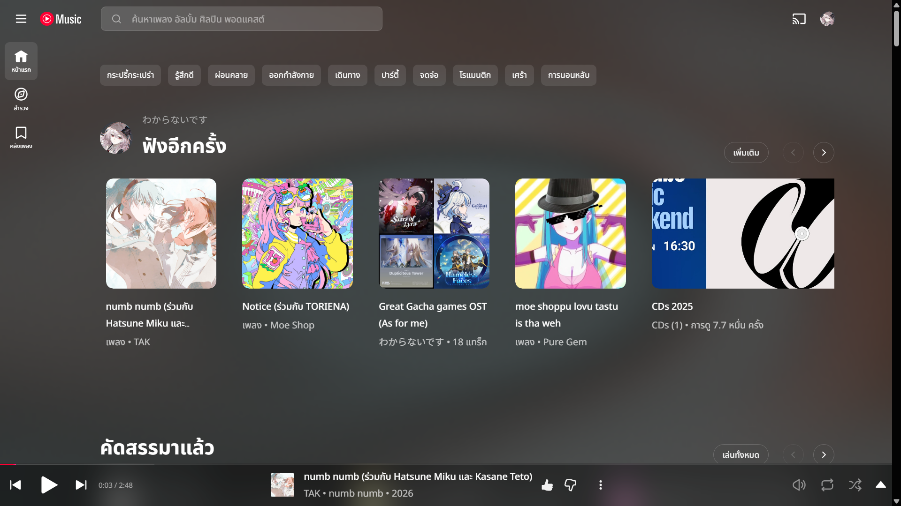
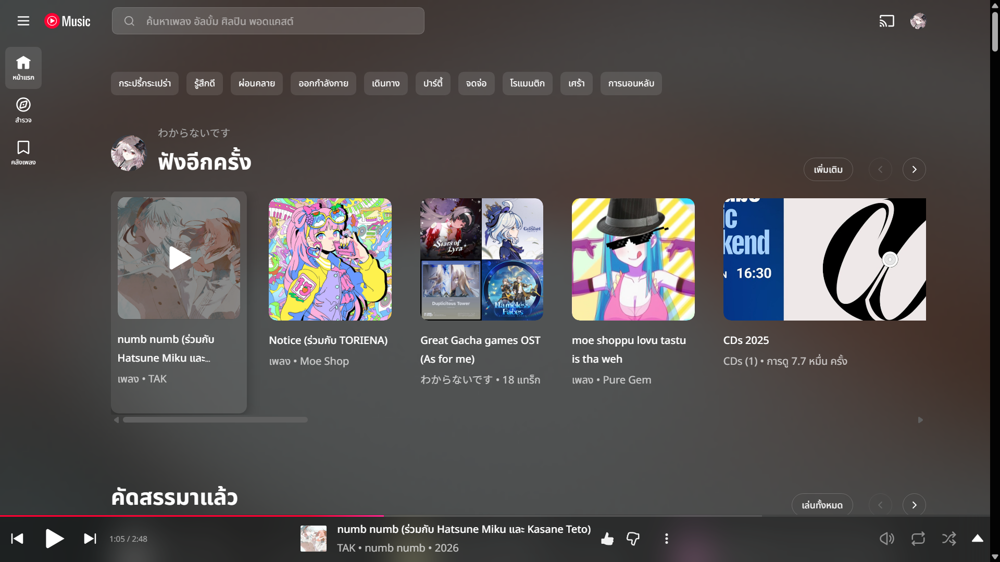
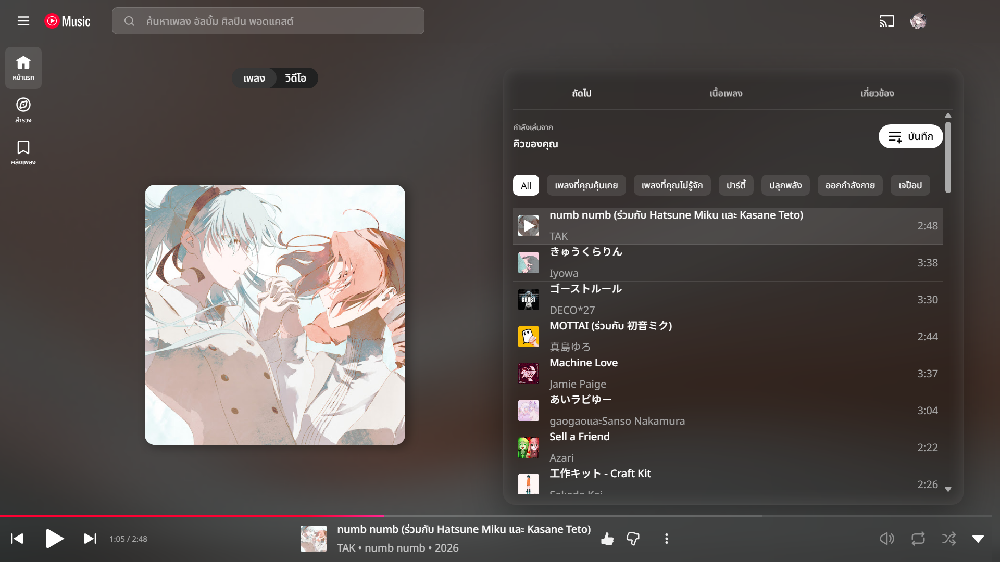
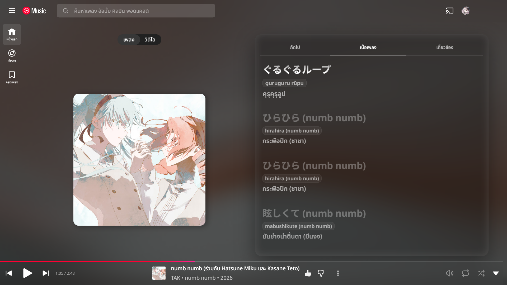
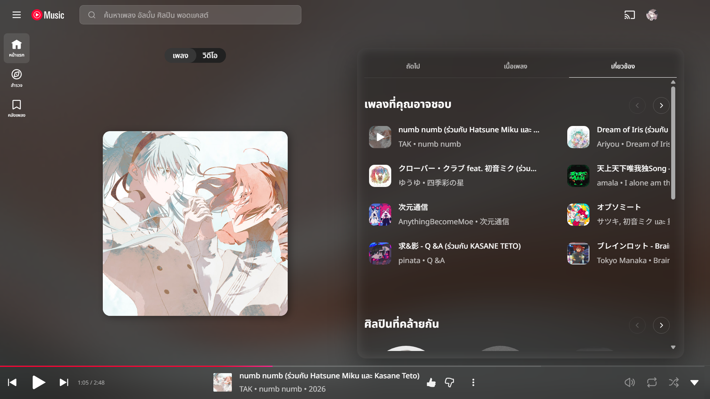
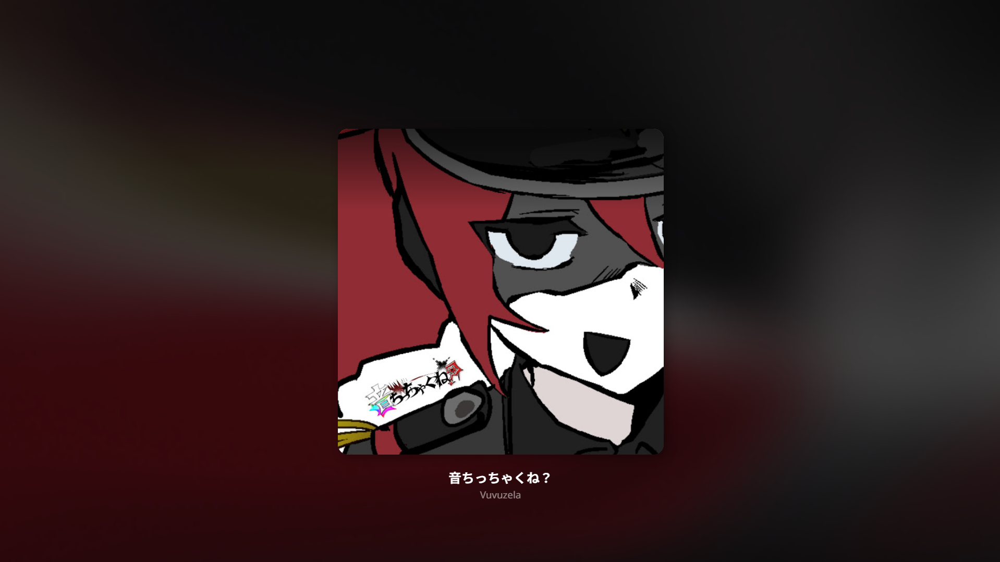

# Wakaranai's YT Music Theme

A **glassmorphism** custom CSS theme for [YouTube Music](https://music.youtube.com) + [Better Lyrics](https://github.com/boidushya/better-lyrics) extension. Bringing frosted glass panels, rounded corners, smooth hover animations, and multi-language font support to your listening experience. Also recommanded to use with [Better Lyrics shader](https://github.com/boidushya/better-lyrics-shaders).

---

## Screenshots

> These screenshots taken with Better Lyrics shader extension installed.

### Home Page

### Hover Effects

### Player - Up Next

### Player - Lyrics

### Player - Related

### Player - Fullscreen

### Player - Fullscreen - No Lyrics

---

  Made with 🤍 by <strong>Wakaranai</strong>

